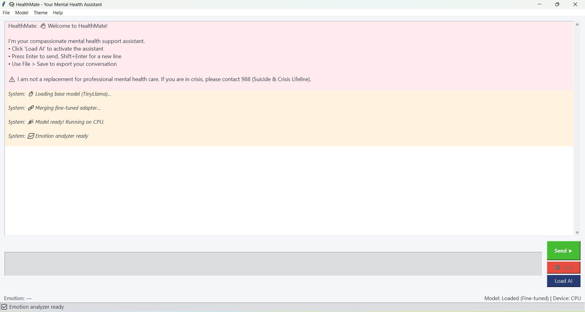
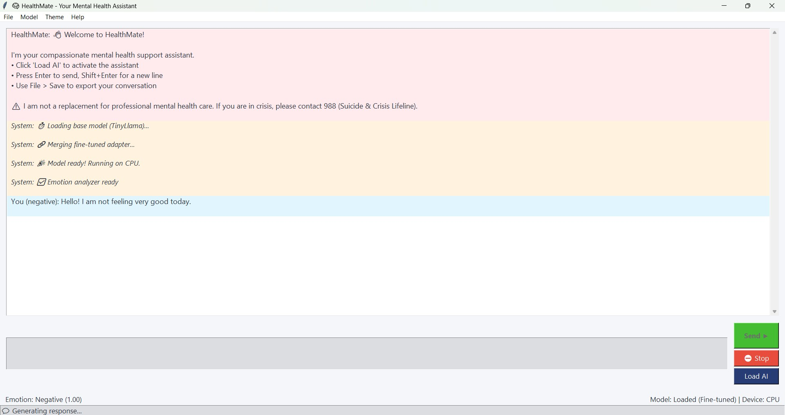
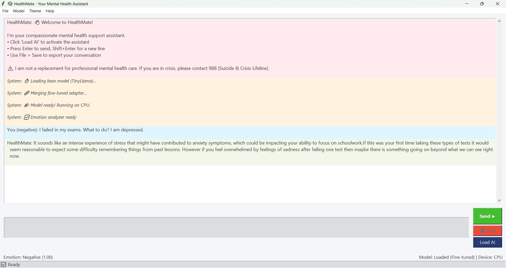

# HealthMate

# AI-Driven Mental Health Support Assistant

A compassionate, privacy-first **Mental Health Chatbot** running locally on fine-tuned LLMs.  
HealthMate combines a customized TinyLlama model, real-time emotion detection, and strict safety guardrails to provide empathetic, conversational support while ensuring users in crisis are safely routed to professional help.

<p align="center">
  <a href="https://github.com/Kyash04/AI-For-Mental-Health">
    
  </a>
  <a href="https://github.com/Kyash04/AI-For-Mental-Health">
    
  </a>
  <a href="https://github.com/Kyash04/AI-For-Mental-Health">
    
  </a>
  <a href="LICENSE">
    
  </a>
</p>

<br/>

Explore the Docs · View Demo · Report Bug · Request Feature

---

# Table of Contents

1. About The Project  
2. Key Features  
3. Technology Stack  
4. Getting Started  
   - Prerequisites  
   - Installation & Setup  
   - Manual Data Setup (Colab Weights)  
5. Usage  
6. Screenshots  
7. Project Structure  
8. Roadmap  
9. Contributors  
10. Acknowledgments  

---

# About The Project

HealthMate solves a major issue — **lack of clinical guardrails in mental health contexts**. 

Instead of relying on a broad, unpredictable API, HealthMate operates as a specialized, locally-run assistant using a **fine-tuned TinyLlama-1.1B model**. It was trained on Google Colab using high-quality counseling conversation datasets (from Kaggle and HuggingFace) using Parameter-Efficient Fine-Tuning (PEFT/LoRA).

The system acts as a supportive listener. It actively analyzes user sentiment to adapt its tone and utilizes a strict set of rule-based guardrails to detect crisis keywords, immediately halting text generation to provide official helpline resources.

---

# Key Features

## Fine-Tuned Empathetic LLM

- Powered by **TinyLlama-1.1B**, specifically fine-tuned using LoRA adapters.
- Trained on curated mental health counseling datasets.
- Optimized for quick, 2-3 sentence warm responses that acknowledge user feelings without attempting medical diagnoses.

## Real-Time Emotion & Sentiment Analysis

- Dual-layered sentiment processing:
  - Uses `distilbert-base-uncased-finetuned-sst-2` for high-accuracy emotion detection.
  - Fallback to `TextBlob` for robust polarity checking.
- Updates the UI dynamically to reflect the user's detected emotional state (e.g., Distressed, Positive, Neutral).

## Strict Safety & Anti-Hallucination Guardrails

- **Crisis Detection:** Instantly detects keywords related to self-harm and overrides the AI to provide the 14416 Suicide & Crisis Lifeline.
- **Identity Protection:** Regular expression (Regex) guardrails prevent the AI from roleplaying as a doctor, nurse, or therapist.
- **Dynamic Stopping Criteria:** Ensures the model stops generating text precisely at the end of its turn, preventing runaway formatting errors.

## Accessible, Themeable GUI

- Built with `Tkinter` for lightweight, cross-platform local execution.
- Features realistic typing simulations to make conversations feel natural.
- Includes Light, Dark, and Calm UI themes.
- Secure, local chat history saving and loading via JSON.

---

## Technical Architecture

### Model Training Pipeline (Colab / Colab T4)
* **Optimization:** Utilizes `BitsAndBytes` for 4-bit NF4 quantization to fit within Colab's T4 GPU limits.
* **Fine-Tuning:** Uses **PEFT (LoRA)** with a rank of 8 (`r=8`) to adjust model weights without catastrophic forgetting.
* **Data Processing:** Implements a `DataCollatorForCompletionOnlyLM` to ensure the model only calculates loss on the assistant's response, preventing it from memorizing user prompts.

### Inference & Frontend Interface
* **Threading:** Asynchronous response generation utilizing Python's `threading` library prevents the UI from freezing during tensor operations.
* **Memory Management:** Dynamically merges the base TinyLlama model with the fine-tuned LoRA adapter at runtime, optimizing CPU/GPU memory usage via `accelerate`.

---

# Technology Stack

| Category | Technology |
| :--- | :--- |
| **Frontend UI** |  |
| **AI & Deep Learning** |   |
| **NLP & Sentiment** |   |
| **Data Processing** |   |


---

# Getting Started

Follow these steps carefully to run the project locally.

---

## Prerequisites

- Python (v3.9 to v3.11 recommended)
- Git
- (Optional but Recommended) A CUDA-compatible GPU for faster inference.

---

## Installation & Setup

### 1. Clone the Repository

```bash
git clone [https://github.com/Kyash04/AI-For-Mental-Health](https://github.com/Kyash04/AI-For-Mental-Health)
cd AI-For-Mental-Health
```

### 2. Install Dependencies

Install the required Python libraries.

```bash
pip install -r requirements.txt 
```
### THE CRITICAL MANUAL STEP (LoRA ADAPTER WEIGHTS)

**STOP!** If you want to use the fine-tuned version of the AI, you must add the adapter weights generated from Google Colab. GitHub does not host large model files.

> **Action Required:**
>
> 1.  Run the `train.py` script in a Google Colab notebook (T4 GPU recommended).
> 2.  Once training is complete, download the output folder from your Colab instance/Google Drive.
> 3.  Create a folder named **`my_finetuned_healthmate_model`** in your local project root.
> 4.  Paste the downloaded `adapter_config.json`, `adapter_model.safetensors`, and tokenizer files into this folder.

_Note: If you skip this step, the app will gracefully fallback to the base TinyLlama model._

## Usage

#### 1. Launch the Application

*(Assuming your main application file is named `app.py`. If you kept the name `gui4.py`, run `python gui4.py` instead).*

```bash
python app.py
```

#### 2. Using the App
- When the UI opens, click **"Load AI"** in the bottom right corner.
- Wait for the model to load into memory (the progress bar will indicate the status).
- Once the status says "✅ Model ready", you can begin chatting.

## Screenshots

###  Main Chat Interface (Calm Theme)

_Real-time chat interface showcasing the local model responding with empathetic support, alongside the live emotion detection status._




## Project Structure

A high-level overview of the project's architecture.

```bash
AI-For-Mental-Health/
├── my_finetuned_healthmate_model/ # [MANUAL] LoRA adapter weights from Colab
│   ├── adapter_config.json        
│   └── adapter_model.safetensors  
├── .gitignore                     # Specifies files to ignore in git
├── app.py                         # Core Tkinter UI and Inference Logic
├── requirements.txt               # Python dependencies
├── train.py                       # Colab Training Script (SFTTrainer, LoRA)
├── healthmate.ico                 # App Icon
└── README.md                      # Project documentation
```

## Roadmap

- [ ] **Voice Integration:** Add Whisper (Speech-to-Text) to allow users to talk to HealthMate naturally.
- [ ] **Larger Base Model:** Upgrade the base model from TinyLlama (1.1B) to Llama-3 (8B) for more nuanced reasoning.
- [ ] **Vector Database (RAG):** Implement a local knowledge base of grounding techniques and breathing exercises.

## Contributors

**Yash Kumar** - [LinkedIn](https://www.linkedin.com/in/yash-kumar-dev) | [GitHub](https://github.com/Kyash04)

## Acknowledgments

Special thanks to the open-source AI community:

- **HuggingFace & TRL:** For making fine-tuning accessible via the `peft` and `trl` libraries.
- **Amod Dataset:** For the excellent mental health counseling conversations dataset.
- **Google Colab:** For providing the accessible T4 compute required to train the model.